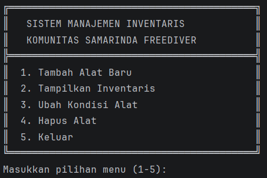
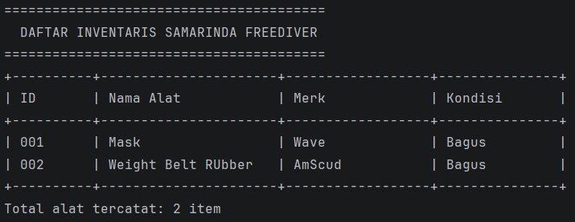
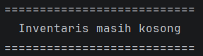
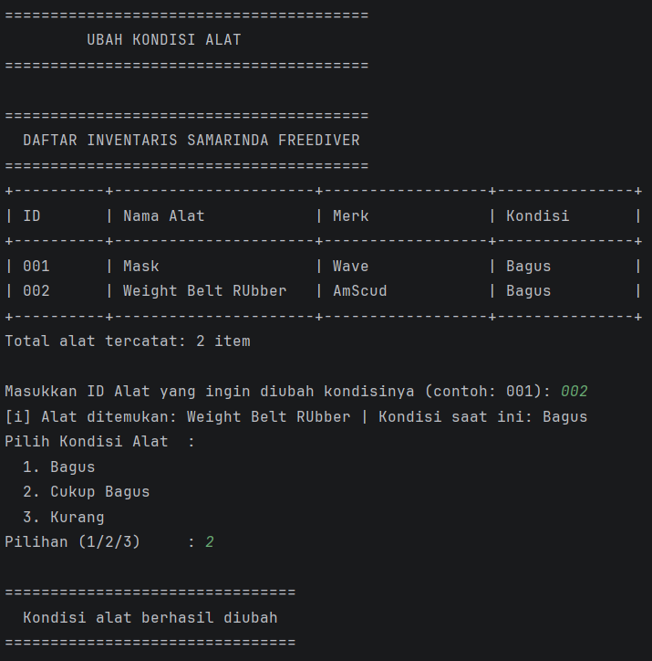
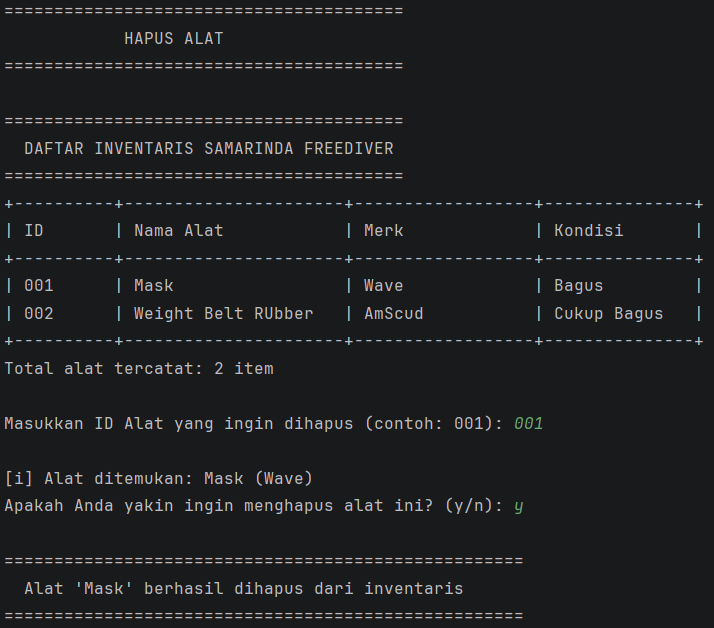

### Ken Bilqis Nuraini
### 2409106015

# Sistem Manajemen Inventaris Samarinda Freediver

> Program manajemen inventaris peralatan freediving berbasis Java (CLI) untuk Komunitas Samarinda Freediver.

---

## Deskripsi Program

Program ini adalah aplikasi **CLI (Command Line Interface)** berbasis Java yang digunakan untuk mengelola inventaris peralatan freediving milik **Komunitas Samarinda Freediver**. Program memiliki 4 fitur utama yaitu:
- ✅ Tambah alat baru ke inventaris
- ✅ Tampilkan seluruh daftar inventaris dalam bentuk tabel
- ✅ Ubah kondisi alat berdasarkan ID
- ✅ Hapus alat dari inventaris dengan konfirmasi

---

## Struktur File

```
posttest1/
├── .idea/
├── out/
├── src/
│   ├── AlatFreedive.java       # Class model/entitas peralatan
│   └── Main.java               # Class utama, menu, dan logika program
├── assets/                     # Folder screenshot output
│   ├── menu-utama.png
│   ├── tambah-alat.png
│   ├── tampil-inventaris.png
│   ├── ubah-kondisi.png
│   └── hapus-alat.png
├── .gitignore
├── posttest1.iml
└── README.md
```

---

## Penjelasan File

### 1. `AlatFreedive.java` — Class Model

Class ini merepresentasikan satu **objek peralatan freedive** sebagai entitas/model data.

#### Constructor

```java
AlatFreedive(String namaAlat, String merk, String kondisi) {
    this.idAlat   = String.format("%03d", counter); // Auto ID: 001, 002, ...
    counter++;
    this.namaAlat = namaAlat;
    this.merk     = merk;
    this.kondisi  = kondisi;
}
```

Setiap kali objek baru dibuat, `counter` bertambah otomatis sehingga ID selalu unik dan berurutan.

#### Method

| Method                              | Keterangan                                            |
|-------------------------------------|-------------------------------------------------------|
| `getIdAlat()`                       | Mengembalikan ID alat                                 |
| `getNamaAlat()`                     | Mengembalikan nama alat                               |
| `getMerk()`                         | Mengembalikan merk alat                               |
| `getKondisi()`                      | Mengembalikan kondisi alat                            |
| `setNamaAlat(String)`               | Mengubah nama alat                                    |
| `setMerk(String)`                   | Mengubah merk alat                                    |
| `setKondisi(String)`                | Mengubah kondisi alat                                 |
| `renumberIds(ArrayList<AlatFreedive>)` | Menomori ulang semua ID setelah penghapusan        |

**Detail Method `renumberIds`:**

```java
static void renumberIds(ArrayList<AlatFreedive> list) {
    for (int j = 0; j < list.size(); j++) {
        list.get(j).idAlat = String.format("%03d", j + 1);
    }
}
```

Method `static` ini dipanggil setiap kali sebuah alat dihapus, agar ID tetap berurutan tanpa celah (contoh: setelah `002` dihapus, `003` menjadi `002`).

---

### 2. `Main.java` — Class Utama

Class ini berisi **semua logika program**, termasuk menu interaktif dan operasi CRUD pada inventaris.

#### Method

| Method                          | Keterangan                                                  |
|---------------------------------|-------------------------------------------------------------|
| `pesanDataKosong()`             | Menampilkan pesan jika inventaris masih kosong              |
| `cetakGaris()`                  | Mencetak garis pemisah tabel                                |
| `cetakHeader()`                 | Mencetak header tabel inventaris                            |
| `formatKolom(String, int)`      | Memformat teks agar lebar kolom konsisten                   |
| `pilihKondisi(Scanner)`         | Menu pilihan kondisi alat (Bagus/Cukup Bagus/Kurang)        |
| `tambahAlat(Scanner)`           | Fitur menambah alat baru ke inventaris                      |
| `tampilkanInventaris()`         | Fitur menampilkan seluruh isi inventaris dalam tabel        |
| `ubahKondisiAlat(Scanner)`      | Fitur mengubah kondisi alat berdasarkan ID                  |
| `hapusAlat(Scanner)`            | Fitur menghapus alat dari inventaris berdasarkan ID         |
| `main(String[])`                | Method utama, berisi loop menu program                      |

---

## Output Program & Screenshot

### Menu Utama

Tampilan menu utama yang muncul setiap kali program dijalankan atau setelah satu menu selesai dijalankan



---

### Fitur 1 - Tambah Alat Baru

User diminta memasukkan nama alat, merk, dan memilih kondisi. Program kemudian menyimpan alat ke `ArrayList` dan menampilkan konfirmasi beserta ID yang digenerate otomatis


---

### Fitur 2 - Tampilkan Inventaris

Menampilkan seluruh data alat dalam format tabel yang rapi



Jika inventaris kosong, program menampilkan pesan khusus



---

### Fitur 3 - Ubah Kondisi Alat

User memasukkan ID alat yang ingin diubah kondisinya. Program mencari alat tersebut, menampilkan kondisi saat ini, lalu meminta kondisi baru



---

### Fitur 4 - Hapus Alat

User memasukkan ID alat yang akan dihapus. Program meminta konfirmasi sebelum benar-benar menghapus, lalu melakukan renumbering ID secara otomatis.



---

### Fitur - Keluar

Program menampilkan pesan

```
================================================================
  Terima kasih! Program Inventaris Samarinda Freediver ditutup
                DIVE SAFE, NEVER DIVE ALONE!
================================================================
```

---

## Alur Program (Flowchart Singkat)

```
START
  │
  ▼
Tampilkan Menu Utama
  │
  ├─ [1] tambahAlat()     → Input nama, merk, kondisi → Simpan ke ArrayList
  ├─ [2] tampilkanInventaris() → Cetak tabel semua alat
  ├─ [3] ubahKondisiAlat() → Cari ID → Update kondisi
  ├─ [4] hapusAlat()      → Cari ID → Konfirmasi → Hapus → Renumber
  └─ [5] Keluar           → programBerjalan = false → END
```

---