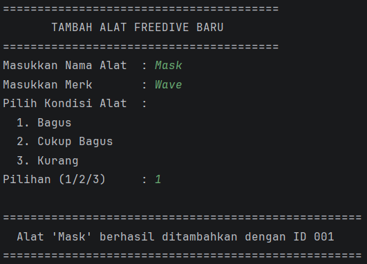

### Ken Bilqis Nuraini
### 2409106015

# Sistem Manajemen Inventaris Samarinda Freediver

> Program manajemen inventaris peralatan freediving berbasis Java (CLI) untuk Komunitas Samarinda Freediver.

---

## Deskripsi Program

Program ini adalah aplikasi **CLI (Command Line Interface)** berbasis Java yang digunakan untuk mengelola inventaris peralatan freediving milik **Komunitas Samarinda Freediver**. Program menerapkan konsep **Encapsulation** dengan penggunaan seluruh jenis **Access Modifier** (`public`, `protected`, package-private, `private`) serta **Getter dan Setter** untuk mengakses dan memodifikasi data. Program memiliki 4 fitur utama yaitu:
- ✅ Tambah alat baru ke inventaris
- ✅ Tampilkan seluruh daftar inventaris dalam bentuk tabel
- ✅ Ubah kondisi alat berdasarkan ID
- ✅ Hapus alat dari inventaris dengan konfirmasi

---

## Struktur File

```
posttest2/
├── .idea/
├── out/
├── src/
│   ├── AlatFreedive.java       # Class model/entitas peralatan
│   └── Main.java               # Class utama, menu, dan logika program
├── assets/                     # Folder screenshot output
│   ├── menu-utama.png
│   ├── tambah-alat.png
│   ├── tampil-inventaris.png
│   ├── ubah-kondisi.png
│   └── hapus-alat.png
├── .gitignore
├── posttest2.iml
└── README.md
```

---

## Konsep OOP yang Diterapkan

### Encapsulation (POSTTEST 2)

Encapsulation diterapkan dengan menjadikan seluruh property di class `AlatFreedive` bersifat `private`, sehingga tidak dapat diakses langsung dari luar class. Akses dan modifikasi data hanya boleh dilakukan melalui method **getter** dan **setter** yang telah disediakan.

### Access Modifier

| Access Modifier | Diterapkan Pada |
|---|---|
| `private` | Seluruh property di `AlatFreedive`, field `inventaris` di `Main`, method-method helper di `Main` |
| `public` | Seluruh getter dan setter di `AlatFreedive`, seluruh method fitur menu di `Main` |
| `protected` | Method `getRingkasan()` di `AlatFreedive` |
| package-private | Method `setIdAlat()` dan `renumberIds()` di `AlatFreedive` |

---

## Penjelasan File

### 1. `AlatFreedive.java` — Class Model

Class ini merepresentasikan satu **objek peralatan freedive** sebagai entitas/model data. Seluruh property bersifat `private` dan hanya dapat diakses melalui getter/setter.

#### Property

| Property | Access Modifier | Tipe | Keterangan |
|---|---|---|---|
| `counter` | `private static` | `int` | Penghitung otomatis untuk ID |
| `idAlat` | `private` | `String` | ID unik alat (format: 001, 002, ...) |
| `namaAlat` | `private` | `String` | Nama peralatan |
| `merk` | `private` | `String` | Merk peralatan |
| `kondisi` | `private` | `String` | Kondisi peralatan |

#### Constructor

```java
AlatFreedive(String namaAlat, String merk, String kondisi) {
    this.idAlat = String.format("%03d", counter);
    counter++;
    this.namaAlat = namaAlat;
    this.merk     = merk;
    this.kondisi  = kondisi;
}
```

Setiap kali objek baru dibuat, `counter` bertambah otomatis sehingga ID selalu unik dan berurutan.

#### Method

| Method | Access Modifier | Jenis | Keterangan |
|---|---|---|---|
| `getIdAlat()` | `public` | getter | Mengembalikan ID alat |
| `getNamaAlat()` | `public` | getter | Mengembalikan nama alat |
| `getMerk()` | `public` | getter | Mengembalikan merk alat |
| `getKondisi()` | `public` | getter | Mengembalikan kondisi alat |
| `getRingkasan()` | `protected` | getter | Mengembalikan ringkasan data alat dalam satu baris |
| `setNamaAlat(String)` | `public` | setter | Mengubah nama alat, dengan validasi tidak boleh kosong |
| `setMerk(String)` | `public` | setter | Mengubah merk alat, dengan validasi tidak boleh kosong |
| `setKondisi(String)` | `public` | setter | Mengubah kondisi alat, dengan validasi tidak boleh kosong |
| `setIdAlat(String)` | package-private | setter | Mengubah ID alat, hanya digunakan secara internal |
| `renumberIds(ArrayList)` | package-private | static | Menomori ulang semua ID setelah penghapusan |

**Contoh penerapan setter dengan validasi:**

```java
public void setKondisi(String kondisi) {
    if (kondisi == null || kondisi.isEmpty()) {
        System.out.println("[!] Kondisi tidak boleh kosong.");
    } else {
        this.kondisi = kondisi;
    }
}
```

**Detail Method `renumberIds`:**

Method `static` package-private ini dipanggil setiap kali sebuah alat dihapus, agar ID tetap berurutan tanpa celah. Karena `idAlat` bersifat `private`, renumbering dilakukan melalui `setIdAlat()`.

```java
static void renumberIds(ArrayList<AlatFreedive> list) {
    for (int j = 0; j < list.size(); j++) {
        list.get(j).setIdAlat(String.format("%03d", j + 1));
    }
    counter = list.size() + 1;
}
```

---

### 2. `Main.java` — Class Utama

Class ini berisi **semua logika program**, termasuk menu interaktif dan operasi CRUD pada inventaris. Field `inventaris` bersifat `private` dan hanya dapat diakses melalui private getter `getInventaris()`.

#### Field

| Field | Access Modifier | Keterangan |
|---|---|---|
| `inventaris` | `private static` | Daftar alat, diakses lewat `getInventaris()` |

#### Method

| Method | Access Modifier | Keterangan |
|---|---|---|
| `getInventaris()` | `private` | getter untuk ArrayList inventaris |
| `getTotalAlat()` | `private` | getter untuk jumlah alat dalam inventaris |
| `pesanDataKosong()` | `private` | Menampilkan pesan jika inventaris masih kosong |
| `cetakGaris()` | `private` | Mencetak garis pemisah tabel |
| `cetakHeader()` | `private` | Mencetak header tabel inventaris |
| `formatKolom(String, int)` | `private` | Memformat teks agar lebar kolom konsisten |
| `pilihKondisi(Scanner)` | `private` | Menu pilihan kondisi alat (Bagus/Cukup Bagus/Kurang) |
| `tambahAlat(Scanner)` | `public` | Fitur menambah alat baru ke inventaris |
| `tampilkanInventaris()` | `public` | Fitur menampilkan seluruh isi inventaris dalam tabel |
| `ubahKondisiAlat(Scanner)` | `public` | Fitur mengubah kondisi alat berdasarkan ID |
| `hapusAlat(Scanner)` | `public` | Fitur menghapus alat dari inventaris berdasarkan ID |
| `main(String[])` | `public` | Method utama, berisi loop menu program |

---

## Output Program & Screenshot

### Menu Utama

Tampilan menu utama yang muncul setiap kali program dijalankan atau setelah satu menu selesai dijalankan


---

### Fitur 1 - Tambah Alat Baru

User diminta memasukkan nama alat, merk, dan memilih kondisi. Program kemudian menyimpan alat ke `ArrayList` dan menampilkan konfirmasi beserta ID yang digenerate otomatis



---

### Fitur 2 - Tampilkan Inventaris

Menampilkan seluruh data alat dalam format tabel yang rapi


Jika inventaris kosong, program menampilkan pesan khusus


---

### Fitur 3 - Ubah Kondisi Alat

User memasukkan ID alat yang ingin diubah kondisinya. Program mencari alat tersebut, menampilkan kondisi saat ini, lalu meminta kondisi baru


---

### Fitur 4 - Hapus Alat

User memasukkan ID alat yang akan dihapus. Program meminta konfirmasi sebelum benar-benar menghapus, lalu melakukan renumbering ID secara otomatis.


---

### Fitur - Keluar

Program menampilkan pesan

```
================================================================
  Terima kasih! Program Inventaris Samarinda Freediver ditutup
                DIVE SAFE, NEVER DIVE ALONE!
================================================================
```

---

## Alur Program (Flowchart Singkat)

```
START
  │
  ▼
Tampilkan Menu Utama
  │
  ├─ [1] tambahAlat()          → Input nama, merk, kondisi → Simpan ke ArrayList
  ├─ [2] tampilkanInventaris() → Cetak tabel semua alat via getter
  ├─ [3] ubahKondisiAlat()     → Cari ID → setKondisi() → Update kondisi
  ├─ [4] hapusAlat()           → Cari ID → Konfirmasi → Hapus → renumberIds()
  └─ [5] Keluar                → programBerjalan = false → END
```

---